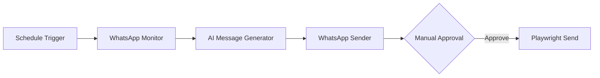
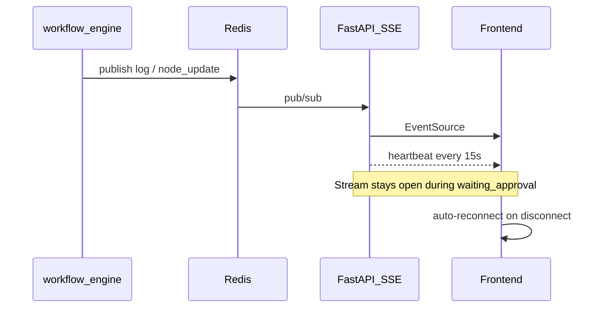

# WhatsApp Attendance Assistant

Production workflow that monitors a WhatsApp group for absence announcements, generates a professional mentor message when **Aakash** is listed absent, and sends it only after human approval.

## Workflow



1. **Schedule Trigger** — daily at 9:00 AM IST (Mon–Sat)
2. **WhatsApp Monitor** — reads recent messages from the configured group
3. **AI Message Generator** — plain-text mentor message (`outputFormat: plain_text`)
4. **WhatsApp Sender** — pauses for approval, then sends via Playwright

## Setup

### Environment

| Variable | Purpose |
|----------|---------|
| `GROQ_API_KEY` | LLM for message generation |
| `DATABASE_URL` | PostgreSQL (Neon) |
| `REDIS_URL` | Optional — pub/sub SSE + execution locks |

### WhatsApp session

```bash
python scripts/login_whatsapp.py
```

Scan the QR code once. Session is stored under `backend/playwright/.auth/session` (gitignored).

### Seed workflow

```bash
python scripts/seed_whatsapp_workflow.py
```

Overwrites the **Personal AI Operations Assistant** workflow in the database.

## Message safety

- AI generator uses `outputFormat: plain_text` — output is not parsed as JSON
- WhatsApp sender validates the final message; JSON-shaped text raises an error
- Approve API rejects JSON before send

## Realtime execution (SSE + Redis)



- **Redis lock** — `workflow_lock:{id}` prevents duplicate runs
- **SSE** — `GET /api/executions/{id}/stream`
- **Heartbeat** — `event: heartbeat` every 15 seconds
- **Approval pause** — stream does not close until `completed`, `failed`, or `cancelled`

## Troubleshooting

| Issue | Fix |
|-------|-----|
| Raw JSON in draft | Re-seed workflow; ensure generator has `outputFormat: plain_text` |
| SSE drops during approval | Pull latest backend + frontend; stream should stay open |
| WhatsApp not logged in | Run `login_whatsapp.py` again |
| Playwright errors on Windows | Backend sets Proactor event loop policy automatically |

## Manual test checklist

1. Run workflow from builder or wait for schedule
2. Confirm draft is plain text on execution detail page
3. Pause on approval for 2+ minutes — logs/heartbeat continue
4. Approve — message sends, execution completes
5. Brief offline in devtools — UI shows “Reconnecting SSE...” then recovers
